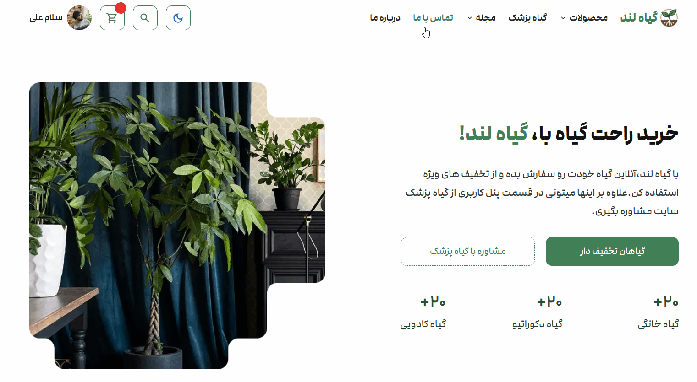
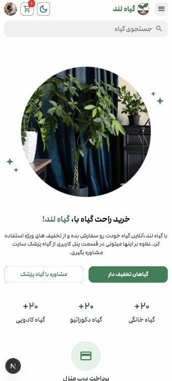
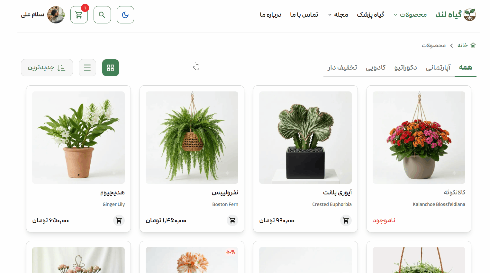
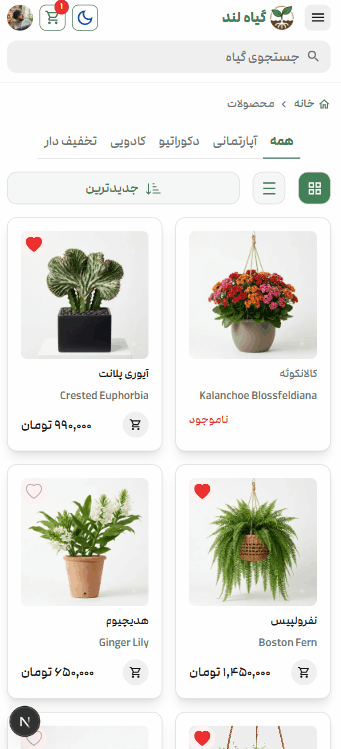
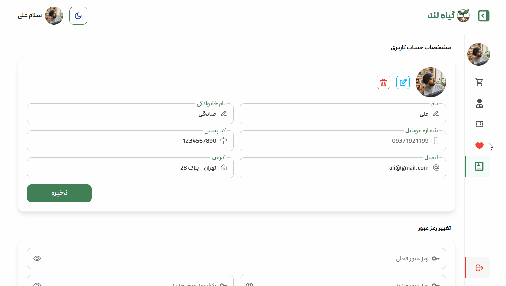
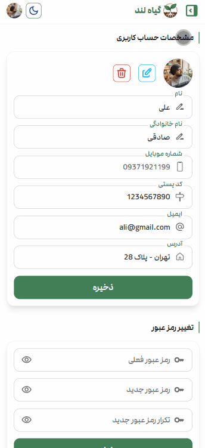
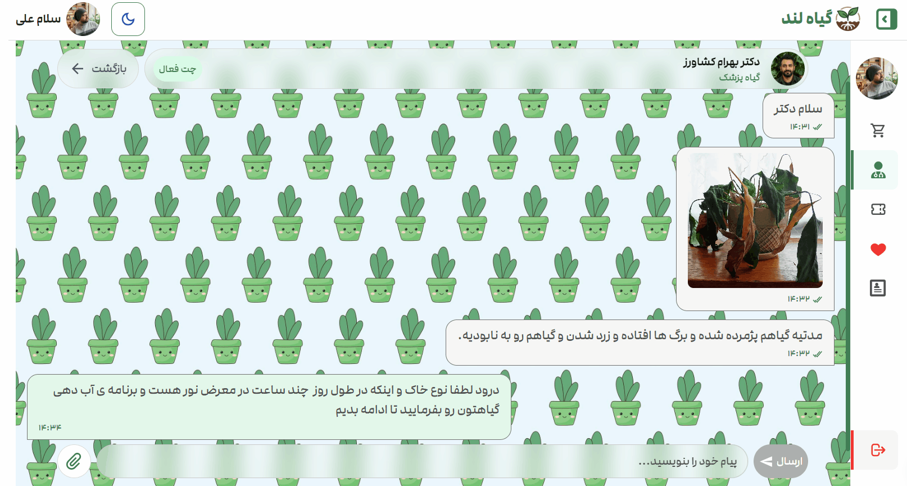
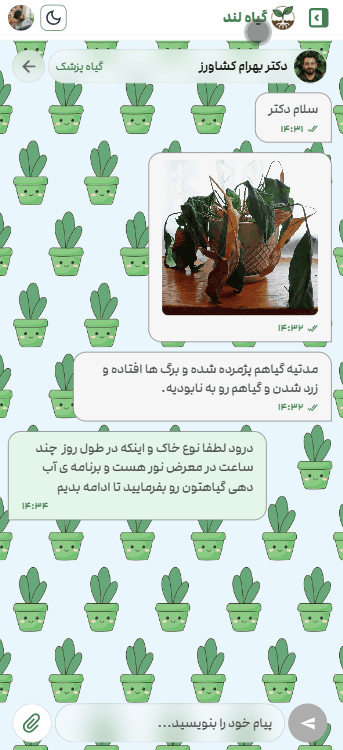

<div align="center">
  <br />
  
  <h1>🌿 Giahland</h1>
  <p>
    <strong>Online Houseplant Shop &amp; Professional Plant Clinic</strong>
  </p>

  ---

<div align="center">
  
  
  
  
  
  
  <br/>
  
  
  
  
  
  
</div>

---


<div align="left">

## 📑 Table of Contents

  <ol style="list-style: none; padding-left: 0;">
    <li> <a href="#-about-the-project">📖 About The Project</a></li>
    <li> <a href="#-key-features">✨ Key Features</a></li>
    <li> <a href="#-roles--rules">👥 Roles & Rules</a></li>
    <li> <a href="#-design-inspiration">🎨 Design Inspiration</a></li>
    <li> <a href="#-screenshots">🖼️ Screenshots</a></li>
    <li> <a href="#-built-with">🧰 Built With</a></li>
    <li> <a href="#-getting-started">🚀 Getting Started</a></li>
    <li> <a href="#-database--seed-data">🗄️ Database & Seed Data</a></li>
    <li> <a href="#-project-structure">📁 Project Structure</a></li>
    <li> <a href="#-license">📝 License</a></li>
    <li> <a href="#-contact">📬 Contact</a></li>
  </ol>
</div>

---

<div align="left">

## 📖 About The Project

Giahland is a fully Persian (RTL), full‑stack e‑commerce platform built from the ground up with **Next.js 15**, **TypeScript**, and **MongoDB**. It combines a beautiful online plant shop with a real‑time **plant clinic**, where users can chat with professional plant doctors, upload images, and receive expert advice.

The application includes **three dedicated panels** — User, Plant Doctor, and Admin — each with role‑specific features and a fully responsive, dark‑mode‑enabled interface.

From the cart to the checkout, the live chat to the admin dashboard charts, every detail has been implemented to mirror a **real‑world, production‑ready application**. This project demonstrates a strong command of modern front‑end architecture, server‑side rendering, and clean, scalable code.


---

## ✨ Key Features

### 🛒 Online Store
- Browse plants by category (**Indoor**, **Decorative**, **Gift**, **Discounted**).
- Switch between **Grid** and **List** view with sorting (newest, price, popularity).
- Product detail page with **image gallery (lightbox)**, specifications, care guides, and approved comments.
- Add to cart, toggle wishlist, and checkout with **delivery method** selection.
- **Simulated payment flow** with a dedicated payment page, order tracking, and printable factor.

### 🩺 Plant Clinic
- Choose from a list of professional **plant doctors**.
- Start a consultation and chat **in real time** (text + image upload).
- Chat UI inspired by **Telegram's** clean and familiar messaging experience.
- Messages marked as **sent/seen**, with unread count notifications.
- Close consultations and increment doctor's successful visits.

### 👤 User Panel
- View **order history** and detailed factor (invoice) for each order.
- Manage **consultations** (list, search, sort, chat).
- Create **support tickets** with file attachments and track replies.
- Update profile information and **upload avatar**.
- **Wishlist** with grid/list view.

### 🧑‍⚕️ Plant Doctor Panel
- Write and manage **articles** using a rich‑text editor (TipTap).
- View and **reply to approved comments** on your articles/products.
- Handle **active consultations**, chat with users, and close them.
- Update profile information and **upload avatar**.
- Create **support tickets** with file attachments and track replies.

### 🛠️ Admin Dashboard
- Dashboard with **real‑time stats** (revenue, orders, users, doctors).
- Interactive **charts** (monthly sales, category pie chart) with fake data.
- Full **product CRUD** with multi‑image upload (optimized to WebP).
- **Article** management (list, create, delete).
- Monitor all **consultations** (read‑only chat view).
- **User management** (list, detail, block/unblock, edit info, create new doctor).
- **Order management** (list, detail, change status to delivered).
- **Comment moderation** (approve, reply, delete, mark read/unread).
- Manage **contact messages** and **support tickets**.

### 🔔 Notifications
- **Role‑based notification system** that keeps every user informed in real time.
- **Users** receive alerts for new consultation messages and ticket replies.
- **Plant Doctors** get notified about new consultation messages, new approved comments on their articles/products, and ticket updates.
- **Admins** see notifications for pending tickets, unread contact messages, and comments awaiting approval.
- Notification badges appear in the header and sidebar, with automatic refresh across pages.

### 🛡️ Authentication & Security
- **JWT‑based auth** with access & refresh tokens (HTTP‑only cookies).
- Automatic **token refresh** via middleware, no user interruption.
- **Role‑based route protection** (middleware + server‑side checks).
- Passwords hashed with **bcryptjs** (12 salt rounds).
- All server actions validate user identity and role before execution.
- **Blocked users** are prevented from signing in or accessing any protected route and are redirected to the dedicated blocked page.

### 🖼️ Image Handling
- **Client‑side preview** before upload for avatars, products, articles, tickets, and chat.
- Automatic **WebP conversion** with quality optimization via Sharp.
- Secure file naming with random strings to prevent **path traversal** attacks.
- Old images cleaned up on update/delete (disk space management).
- **Lightbox gallery** for product images (swipe, keyboard navigation).

### 🔍 Search & Navigation
- **Real‑time product search** with 500ms debounce and loading state.
- **Breadcrumb navigation** with dynamic title support and responsive truncation.
- **URL‑based filtering & sorting** on all product and blog listing pages.
- **Pagination** on all list pages with proper page reset on filter change.
- **Scroll‑to‑top button** with circular progress indicator, visible on all pages except the chat screen to avoid overlap.

### ⚡ Performance & SEO
- **Next.js 15 App Router** with Server Components for optimal performance.
- **unstable_cache** and **revalidateTag** for smart cache invalidation.
- **Lazy loading** for below‑the‑fold content (homepage sliders, product images).
- **Metadata & Open Graph** tags on all pages for SEO.
- Custom **404 page** with Persian messaging and navigation.

### ✍️ Content & Forms
- **Rich‑text editor** (TipTap) with image embedding for blog articles.
- **Zod validation** on both client (React Hook Form) and server (Server Actions).
- Inline **error handling** with toast notifications and field‑level messages.

### 📊 Charts & Dashboard
- **Monthly sales line chart** and **category pie chart** with dark‑mode‑aware colors.
- **Animated counters** (CountUp) for stats and hero numbers.
- Real‑time stats calculation using MongoDB aggregation pipelines.

### 🎨 User Experience
- **Full Dark Mode** – persisted in cookies & localStorage, zero flicker on reload.
- **Fully responsive** from mobile to wide desktop.
- Skeleton loaders, smooth animations, toast notifications.
- Custom Persian font (**Modam**) with full RTL support.
- Sticky headers and dynamic overlays for smooth navigation.


### 🎯 Attention to Detail
- **Custom‑styled scrollbar** matching the brand’s green identity (`#417f56`), applied globally.
- **Blocked user flow:** a logged‑in blocked user is immediately restricted from accessing any panel and redirected to the `/blocked` page with a helpful message. Once they log out, they cannot sign in again.
- Empty states designed with helpful illustrations and CTA buttons (empty cart, no orders, etc.).
- **Fallback images** for broken or missing profile pictures.

</div>

---

<a name="roles--rules"></a>

<div align="left">
  
## 👥 Roles & Rules

Giahland has **three distinct roles**, each with carefully scoped permissions. This separation ensures security, clean UX, and prevents unauthorized access.

</div>

<br>

| Permission | 👤 User | 🧑‍⚕️ Plant Doctor | 🛠️ Admin |
|---|---|---|---|
| Browse & search products | ✅ | ✅ | ✅ |
| Add to cart & checkout | ✅ | ❌ | ❌ |
| Like/Wishlist products | ✅ | ❌ | ❌ |
| Create & manage consultations | ✅(create) | ✅ (close) | ✅ (monitor all and close) |
| Real‑time chat in consultations | ✅ | ✅ | 👀 Read‑only |
| Create support tickets | ✅ | ✅ | ✅ (manage all and reply) |
| Write & publish blog articles | ❌ | ✅ | ✅ |
| Reply to approved comments | ❌ | ✅(conditional) | ✅ |
| Comment moderation | ❌ | ❌ | ✅ |
| View order history & factors | ✅(pay pending) | ❌ | ✅ (all users) |
| Update own profile & avatar | ✅ | ✅ | ✅ |
| Access admin dashboard | ❌ | ❌ | ✅ |
| Manage products (CRUD) | ❌ | ❌ | ✅ |
| Manage users (block/edit/create) | ❌ | ❌ | ✅ |
| Manage contact messages | ❌ | ❌ | ✅ |
| Change order status | ❌ | ❌ | ✅ |
| Receive role‑based notifications | ✅ | ✅ | ✅ |

<br>

<div align="left">

### 🚫 Important Restrictions

- **Plant Doctors & Admins** cannot add items to cart, checkout, or like products. These UI elements are **hidden** for them.
- **Plant Doctors** can only reply to comments that are:
  - on **any product** or on their **own articles**.
  - already **approved** by admin.
  - **not yet replied to** by admin.
- **Admins** can reply to any comment, and their reply **replaces** any existing doctor or admin response.
- **Blocked users** are instantly logged out and redirected to `/blocked`. They **cannot sign in** until unblocked by an admin.
- **The first registered user** automatically becomes the **super admin** with full system access.

</div>

---

<a name="-design-inspiration"></a>

<div align="left">

## 🎨 Design Inspiration

The initial visual direction for the homepage was inspired by an **early, unfinished concept** shared by **[Farhad Raoufi](https://www.figma.com/@farhadraoufi)** on Figma Community ([view concept](https://www.figma.com/community/file/1402547134501760376)), licensed under **CC BY 4.0**.  
As the original creator noted, *"this was designed as a concept and was never continued."*

Starting from that basic starting point, **Giahland was built from the ground up** and expanded into a full-featured, production‑grade platform — orders of magnitude beyond the initial idea:

- A fully integrated **e‑commerce store** with cart, checkout, and payment flow.
- A real‑time **plant clinic** with live chat and image sharing.
- Three dedicated **panels** for Users, Plant Doctors, and Admins.
- A complete **dark mode** system, role‑based notifications, interactive charts, and much more.

> This is not a redesign — it's a complete **product development**, turning an unfinished concept into a scalable, real‑world application.

</div>

---

<h1 id="-screenshots"></h1>

<div align="left">

## 🖼️ Screenshots

> Each GIF shows the **desktop & mobile** view with a **light → dark mode** transition.


### 🏠 Homepage
<details>
<summary>View Screenshots</summary>

| 🖥️ Desktop | 📱 Mobile |
|:---:|:---:|
|  |  |

</details>

### 🛒 Products
<details>
<summary>View Screenshots</summary>

| 🖥️ Desktop | 📱 Mobile |
|:---:|:---:|
|  |  |

</details>

### 📱 Product Detail
<details>
<summary>View Screenshots</summary>

| 🖥️ Desktop | 📱 Mobile |
|:---:|:---:|
|  |  |

</details>

### 👤 User Panel
<details>
<summary>View Screenshots</summary>

| 🖥️ Desktop | 📱 Mobile |
|:---:|:---:|
|  |  |

</details>

### 🩺 Consultation & Chat
<details>
<summary>View Screenshots</summary>

| 🖥️ Desktop | 📱 Mobile |
|:---:|:---:|
|  |  |

</details>

### 🛠️ Admin Dashboard
<details>
<summary>View Screenshots</summary>

| 🖥️ Desktop | 📱 Mobile |
|:---:|:---:|
|  |  |

</details>
</div>

---

<a name="-built-with"></a>

<div align="left">

## 🧰 Built With

| Category | Technology |
|---|---|
| **Framework** | Next.js 15.5 (App Router) |
| **Language** | TypeScript 5 |
| **Styling** | Tailwind CSS 4 |
| **State Management** | Zustand 5 |
| **Database** | MongoDB + Mongoose 9 |
| **Authentication** | JWT (jsonwebtoken 9) + bcryptjs 3 |
| **Validation** | Zod 4 (client & server) |
| **Forms** | React Hook Form 7 |
| **Charts** | Recharts 3 |
| **Rich Text Editor** | TipTap 3 |
| **Image Processing** | Sharp 0.35 |
| **Carousel** | Swiper 12 |
| **Lightbox** | Yet Another React Lightbox 3 |
| **Animations** | CountUp 6 |
| **Notifications** | React Hot Toast 2 |
| **Icons** | React Icons 5 |

</div>

---

<a name="-getting-started"></a>

<div align="left">

## 🚀 Getting Started


### 🛠️ Step 1: Install the Tools You Need

You need **three free tools** installed on your computer:

| Tool | What it does | Download link |
|---|---|---|
| **Node.js** | Runs the website code | [Download Node.js](https://nodejs.org/) (choose the LTS version) |
| **MongoDB Server** | The database engine that stores all data | [Download MongoDB](https://www.mongodb.com/try/download/community) |
| **MongoDB Compass** | A visual app to view and manage the database | [Download Compass](https://www.mongodb.com/try/download/compass) |

> 🔄 **Important:** After installing all three, restart your computer to make sure everything is set up correctly.

> 💡 **MongoDB Server** runs in the background (you won't see a window for it).  
> **MongoDB Compass** is the app you'll actually open to see your data.

---

### 📁 Step 2: Get the Project Files

1.  Open **Command Prompt** (Windows) or **Terminal** (Mac).
2.  Type these commands one by one, pressing **Enter** after each:

    ```bash
    # Download the project to your computer
    git clone https://github.com/alisadeghi192/nextjs-full-stack-ecommerce-giahland.git

    # Go inside the project folder
    cd nextjs-full-stack-ecommerce-giahland

    # Install all the pieces the project needs to run
    npm install
    ```

### 🗄️ Step 3: Set Up the Database

Now you need to create a space where all your store data (products, users, orders) will live.

1.  Make sure **MongoDB Server** is running:
    - On Windows, it usually starts automatically after installation. If not, search for "Services" in the Start menu, find "MongoDB" and start it.
    - On Mac, if you installed via Homebrew, run: `brew services start mongodb-community`
2.  **Open MongoDB Compass**.
3.  In the connection bar at the top, you should see: `mongodb://localhost:27017`.
    - If not, type it and click **"Connect"**.
4.  On the left sidebar, you'll see **Databases**. Click the **"+"** button to create a new one.
5.  Fill in:
    - **Database Name:** `giahland`
    - **Collection Name:** `users` (just a temporary name)
    - Click **"Create Database"**.

> ✅ You now have an empty database ready to receive our sample data!
### 📦 Step 4: Import Sample Data (Seed)

I've prepared a package of sample data so your store doesn't look empty.  
Inside the project folder, you'll find a folder called **`seed`**. It contains three files:

- `products.json` – all the beautiful plants for the shop
- `articles.json` – blog posts about plant care and styling
- `users.json` – test accounts (admin, doctor, customer)

Let's import them into your database using Compass:

1.  In **MongoDB Compass**, select your database (`giahland`) from the left sidebar.
2.  Click the **"Create Collection"** button and make these three collections **with exactly these names**: 
    - `products`
    - `articles`
    - `users`
3.  Now, for each collection, do the following:
    - Click on the collection name (e.g., `products`).
    - Click the green **"Add Data"** button → **"Import JSON or CSV file or Import file"**.
    - Browse to the `seed` folder inside the project and select the matching JSON file.
    - Click **"Import"**.

After importing all three files, your database is full of data! 🎉

---

### ⚙️ Step 5: Configure the Environment (Secret Keys)

The project needs to know where your database is and some secret keys for security.

1.  Inside the project folder, find the file named **`.env.example`**.
2.  Make a copy of it and rename the copy to **`.env.local`** (just delete the `.example` part).
3.  Open `.env.local` with Notepad (or any text editor). You'll see something like:

    ```env
    ACCESS_TOKEN_SECRET=your_access_token_secret
    REFRESH_TOKEN_SECRET=your_refresh_token_secret
    MONGO_URL=mongodb://localhost:27017/giahland
    ```


4.  You can keep the `MONGO_URL` as it is (if you used the local database setup).  
    For `ACCESS_TOKEN_SECRET` and `REFRESH_TOKEN_SECRET`, you can type any long random string (like `my_super_secret_key_123`).  
    Example of a filled `.env.local`:

    ```env
    ACCESS_TOKEN_SECRET=my_super_secret_key_123
    REFRESH_TOKEN_SECRET=my_super_refresh_key_456
    MONGO_URL=mongodb://localhost:27017/giahland
>🔒 These are just for local testing. In a real website, you would use much more complex secrets.

### 🚀 Step 6: Start the Website!

Everything is ready. In your terminal (still inside the project folder), run:

```bash
npm run dev
```

You'll see some output, and after a few seconds, it will say something like:  
`Ready on http://localhost:3000`

1.  Open your web browser.
2.  Go to **http://localhost:3000**.

The store should now appear, filled with plants and articles! 🎉

---

### 👤 Test Accounts (from seed data)

Use these accounts to log in and explore different roles:

| Role | Mobile | Password | What you can see |
|---|---|---|---|
| **Admin** | `09111111111` | `Admin123` | Full admin dashboard, manage everything |
| **6 Plant Doctors** | `09122222222 to  09127777777` | `Admin123` | Doctor panels, write articles, reply to comments |


> 💡 **You can also register a new account that will be regular user** 

>💡 Additionally, the seed data already includes **admin** and **6 plant doctors**, so you can immediately test consultations without creating new doctor accounts.

---

### 🛑 Stopping the Website

When you're done, go back to the terminal and press **`Ctrl + C`** to stop the server.

---

### ❓ Something Went Wrong?

- If the website doesn't start, make sure **MongoDB Server** is running (check Step 3).
- If you see a database error, double‑check that you imported all three seed files correctly with correct collection name.
- If you encounter any other issue, don't panic! Ask a developer friend or paste the error message into an AI assistant like ChatGPT or Claude – they can usually spot the problem instantly.

</div>

---

<a name="-project-structure"></a>

<div align="left">

## 📁 Project Structure

Here's a quick map of the project's main folders, so you know where everything lives.  
No need to memorize it – just come back here if you ever get lost.

<details>
<summary>📂 View Full Project Tree</summary>

```
giahland/
├── public/                         # Static assets
│   ├── static/                     # Static files (images, fonts)
│   │   ├── fonts/                  # Custom Modam font
│   │   └── images/                 # Logo, banners, hero images, blog images, product images
│   └── uploads/                    # User uploaded files (gitignored)
│       ├── users/                  # User avatars
│       ├── products/               # Product gallery images
│       ├── blog/                   # Blog article images
│       ├── consultations/          # Chat images
│       └── tickets/                # Ticket attachments
│
├── seed/                           # Database seed data (for initial setup)
│   ├── users.json                  # Sample users (admin, doctor, regular users)
│   ├── products.json               # Sample products (indoor, decoration, gift)
│   ├── articles.json               # Sample blog articles (care, health, styling)
│   ├── orders.json                 # Sample orders
│   ├── comments.json               # Sample comments
│   └── consultations.json          # Sample consultations
│
├── src/
│   ├── app/                        # Next.js App Router
│   │   ├── (auth)/                 # Authentication routes (login/register)
│   │   ├── (panel)/                # User & Doctor dashboard
│   │   │   └── user/
│   │   │       ├── (doctor)/       # Doctor-specific pages (articles, comments)
│   │   │       ├── consultations/  # Consultation pages
│   │   │       ├── orders/         # Order pages
│   │   │       ├── profile/        # Profile page
│   │   │       ├── tickets/        # Ticket pages
│   │   │       └── wishlist/       # Wishlist page
│   │   ├── (public)/               # Public routes
│   │   │   ├── about/              # About page
│   │   │   ├── blog/               # Blog listing & detail pages
│   │   │   ├── cart/               # Cart page
│   │   │   ├── checkout/           # Checkout page
│   │   │   ├── contact/            # Contact page
│   │   │   ├── payment/            # Payment pages
│   │   │   ├── plant-doctor/       # Plant doctor landing page
│   │   │   └── products/           # Product listing & detail pages
│   │   ├── admin/                  # Admin panel
│   │   │   ├── articles/           # Article management
│   │   │   ├── comments/           # Comment management
│   │   │   ├── consultations/      # Consultation management
│   │   │   ├── contact-messages/   # Contact messages management
│   │   │   ├── dashboard/          # Admin dashboard
│   │   │   ├── orders/             # Order management
│   │   │   ├── products/           # Product management
│   │   │   ├── tickets/            # Ticket management
│   │   │   └── users/              # User management
│   │   ├── api/                    # API routes (image fallback)
│   │   ├── favicon.ico
│   │   ├── globals.css             # Global styles (Tailwind + dark mode)
│   │   ├── layout.tsx              # Root layout with SSR theme support
│   │   └── not-found.tsx           # 404 page
│   │
│   ├── components/                 # Reusable UI components
│   │   ├── admin/                  # Admin-specific components
│   │   │   ├── comments/           # Admin comment components
│   │   │   ├── consultations/      # Admin consultation components
│   │   │   ├── dashboard/          # Dashboard components (charts, stats, recent lists)
│   │   │   ├── forms/              # Admin forms (product, profile)
│   │   │   ├── messages/           # Contact messages components
│   │   │   ├── orders/             # Admin order components
│   │   │   ├── products/           # Admin product components
│   │   │   ├── tickets/            # Admin ticket components
│   │   │   └── users/              # Admin user components
│   │   ├── doctor/                 # Doctor panel components (articles, comments)
│   │   ├── features/               # Feature-based components
│   │   │   ├── about/              # About page components
│   │   │   ├── auth/               # Authentication components (login, register, logout)
│   │   │   ├── blog/               # Blog components (cards, sliders, forms)
│   │   │   ├── cart/               # Cart components (modal, items, summary)
│   │   │   ├── checkout/           # Checkout components (delivery, user info)
│   │   │   ├── consultations/      # Consultation components (chat, cards, doctors)
│   │   │   ├── contact/            # Contact form
│   │   │   ├── landing/            # Landing page components (hero, banners, services)
│   │   │   ├── order/              # Order components (factors, cards, badges)
│   │   │   ├── payment/            # Payment components (cards, success)
│   │   │   ├── plant-doctor/       # Plant doctor CTA components
│   │   │   ├── products/           # Product components (cards, grids, galleries, specs)
│   │   │   └── tickets/            # Ticket components (form, list, items)
│   │   ├── panel/                  # Panel layout components (sidebar, header, layout)
│   │   ├── providers/              # Context providers (Auth, Theme, Toaster)
│   │   └── shared/                 # Shared components
│   │       ├── layout/             # Layout components (header, footer)
│   │       └── ui/                 # Reusable UI components (buttons, inputs, modals, pagination)
│   │
│   ├── features/                   # Feature modules (business logic)
│   │   ├── auth/                   # Authentication (actions, schemas, types, selectors)
│   │   ├── blog/                   # Blog (actions, schemas, types)
│   │   ├── cart/                   # Cart (actions, selectors, types)
│   │   ├── comments/               # Comments (actions, schemas, types)
│   │   ├── consultations/          # Consultations (actions, types)
│   │   ├── contact/                # Contact (actions, schemas)
│   │   ├── notifications/          # Notifications (actions, hooks, types)
│   │   ├── order/                  # Order (actions, schemas, types)
│   │   ├── payment/                # Payment (actions)
│   │   ├── products/               # Products (actions, schemas, types)
│   │   ├── tickets/                # Tickets (actions, schemas, types, utils)
│   │   ├── theme/                  # Theme (actions)
│   │   └── user/                   # User management (actions, schemas, types)
│   │
│   ├── lib/                        # Utilities, helpers, constants, DB models
│   │   ├── auth/                   # JWT helpers (tokens, cookies, password)
│   │   ├── constants/              # App constants (banners, roles, nav, pagination)
│   │   ├── db/                     # Database connection & Mongoose models
│   │   │   ├── models/             # Mongoose models (User, Product, Order, Article, etc.)
│   │   │   └── connect.ts          # MongoDB connection
│   │   ├── hooks/                  # Custom React hooks (useScroll, useUrlParams)
│   │   └── utils/                  # Utility functions (format, price, image-upload)
│   │
│   ├── stores/                     # Zustand state management
│   │   ├── selectors/              # UI selectors
│   │   ├── useAuthStore.ts         # Authentication store
│   │   ├── useCartStore.ts         # Cart store
│   │   ├── useNotificationStore.ts # Notification store
│   │   ├── useThemeStore.ts        # Theme store
│   │   └── useUIStore.ts           # UI state store (modals, menus)
│   │
│   ├── types/                      # Global TypeScript type definitions
│   └── middleware.ts               # Next.js middleware (auth, redirects, refresh token)
│
├── .env.local.example              # Environment variables example
├── .gitignore                      # Git ignore file (includes node_modules, .next, public/uploads)
├── declarations.d.ts               # Global type declarations (CSS modules, SVG, Swiper)
├── eslint.config.mjs               # ESLint configuration (flat config)
├── next.config.ts                  # Next.js configuration (body size, rewrites)
├── package.json
├── package-lock.json               # Exact dependency tree (git committed)
├── postcss.config.mjs              # PostCSS configuration (Tailwind)
├── prettier.config.js              # Prettier configuration (aliases)
├── swiper.d.ts                     # Swiper type definitions (for CSS modules)
├── tsconfig.json
└── README.md                       #👋 Hello you are here now.
```